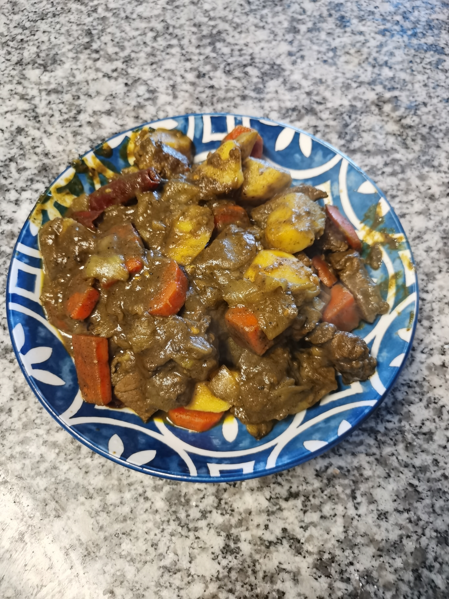

# 咖喱土豆牛肉

## ingredient

1. 土豆
2. 牛腩
3. 苹果汁
4. 一颗洋葱
5. 料酒
6. 土豆块，胡萝卜块
7. 咖喱
8. 两勺生抽
9. 半勺老抽
10. 两勺蜂蜜
11. 牛奶 

## Step
0. 牛肉泡血水，切好洋葱
1. 将洋葱炒香
2. 炒牛肉
3. 放水煮
4. 切胡萝卜，土豆
5. 放入咖喱，土豆，胡萝卜，生抽，老抽，蜂蜜，牛奶
6. 煮半小时

## Image

