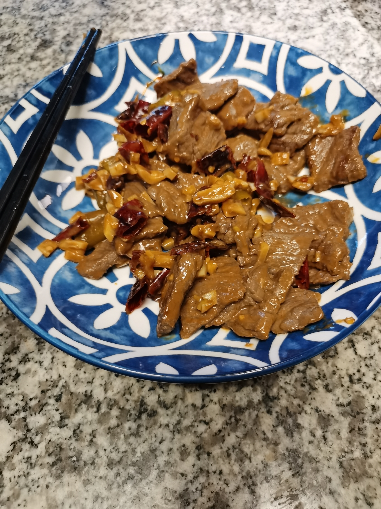

# 小炒黄牛肉

## Ingredient
- 牛肉
- 生粉
- 生抽
- 蚝油
- 油
- 盐
- 小米椒
- 泡椒
- 大蒜
- 姜
- 欧芹

## Step
1. 将牛肉切成片
1. 将牛肉和生抽，蚝油，生粉，油一起腌制
1. 将姜，蒜切成末
2. 将小米椒，泡脚切成段
3. 放油，放入姜蒜末，小米椒，泡椒，炒出香味
4. 放入牛肉，炒至变色
5. 放入欧芹，简单炒几下

## Image
